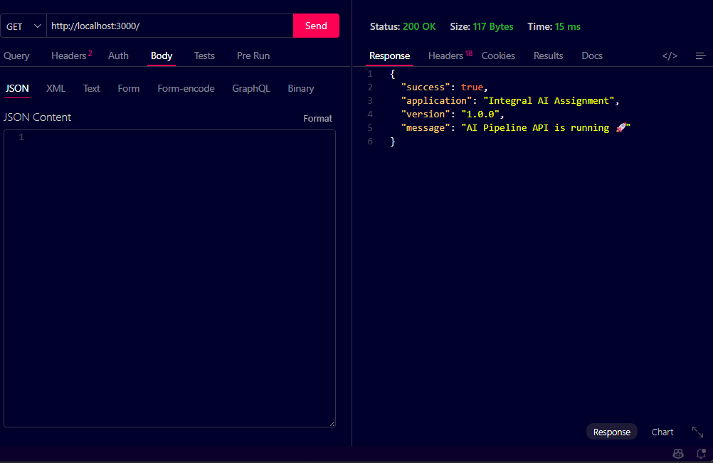
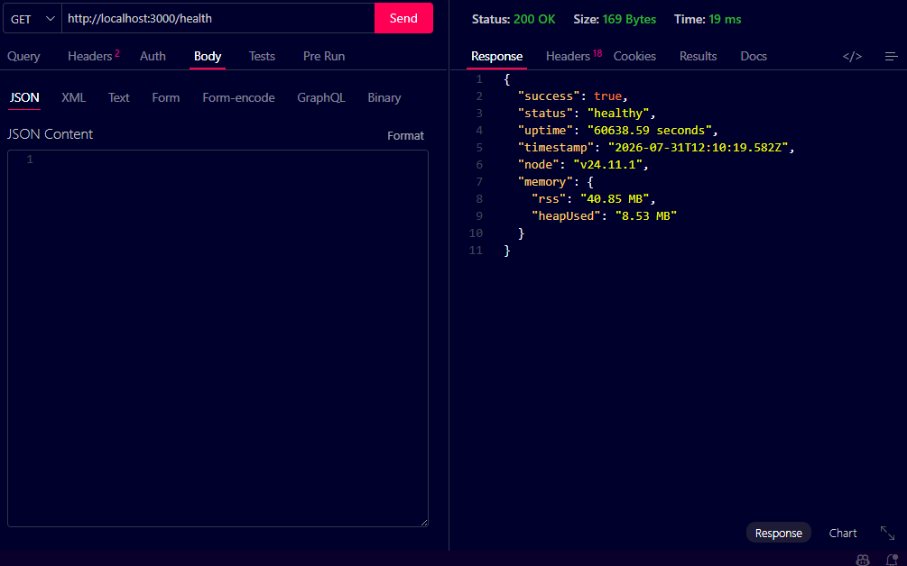
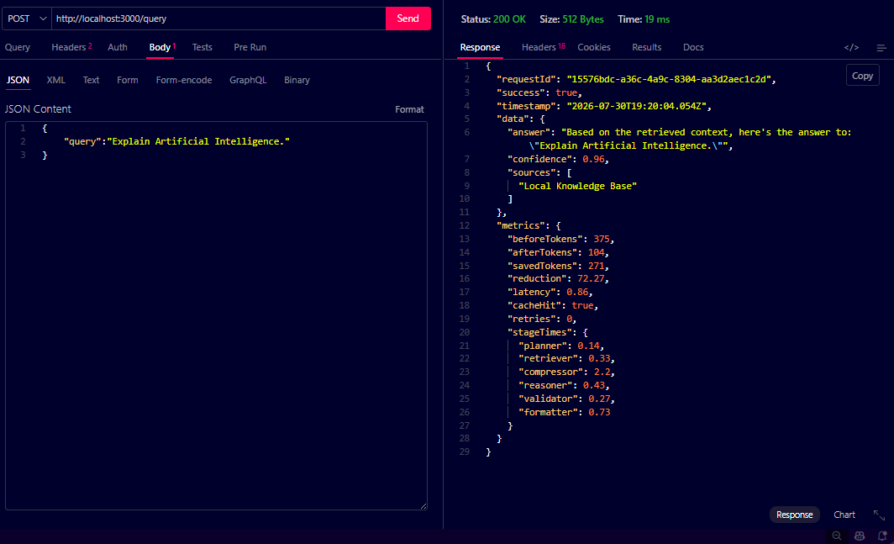
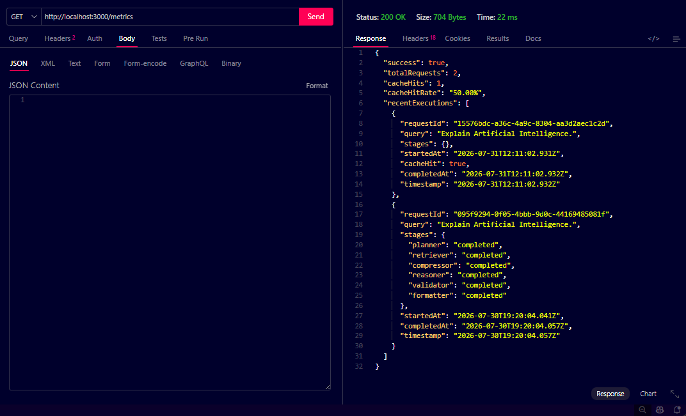
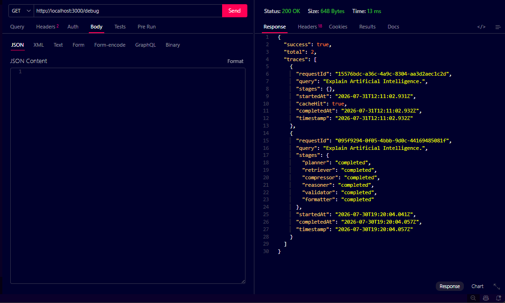
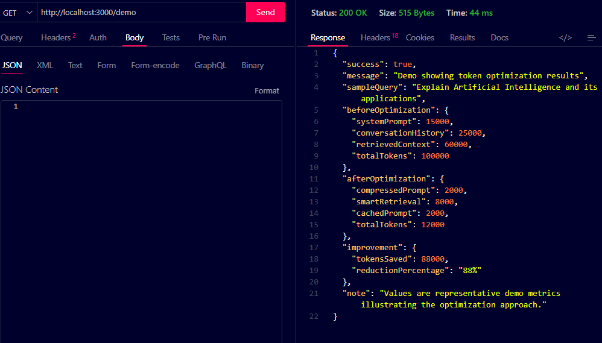

<div align="center">

# Integral AI Assignment

### *Building a Cost-Aware, Observable, and Deployment-Ready AI Agent Pipeline*

<p>


</p>

*A modular AI agent pipeline demonstrating token optimization, structured debugging, observability, and deployment best practices.*

</div>

---

# Overview

This repository contains my submission for the **Integral AI Engineering Assignment**.

Rather than focusing only on generating an AI response, the project emphasizes the engineering practices required to build reliable AI systems at scale:

- 💰 Cost-aware token optimization
- 🔍 End-to-end debugging and observability
- 📊 Metrics and request tracing
- ⚡ Response caching
- 🚀 CI/CD readiness
- 🐳 Containerized deployment support

The application simulates a production-style AI pipeline where every request flows through multiple independent agents before producing a validated response.

---

# Key Highlights

| Feature | Status |
|----------|:------:|
| Modular AI Agent Pipeline | ✅ |
| Context Compression | ✅ |
| Response Cache | ✅ |
| Request Tracing | ✅ |
| Metrics Collection | ✅ |
| Health Monitoring | ✅ |
| Debug Endpoint | ✅ |
| Docker Configuration | ✅ |
| GitHub Actions CI | ✅ |

---

# Assignment Objectives

This project addresses all three parts of the assignment.

| Assignment Part | Solution |
|-----------------|----------|
| Part 1 – Token Optimization | Context compression + response caching with measurable token savings |
| Part 2 – Debugging | Request tracing, execution metrics, structured debugging workflow |
| Part 3 – CI/CD & Deployment | Docker configuration, GitHub Actions workflow, secrets management, rollback strategy |

---

# System Architecture

```text
                        ┌──────────────┐
                        │ User Request │
                        └──────┬───────┘
                               │
                               ▼
                     ┌──────────────────┐
                     │ Express API      │
                     └────────┬─────────┘
                              │
                              ▼
                     ┌──────────────────┐
                     │ Planner Agent    │
                     └────────┬─────────┘
                              │
                              ▼
                     ┌──────────────────┐
                     │ Retriever Agent  │
                     └────────┬─────────┘
                              │
                              ▼
                  ┌─────────────────────────┐
                  │ Context Compression     │
                  └────────┬────────────────┘
                           │
                           ▼
                  ┌─────────────────────────┐
                  │ Reasoner Agent          │
                  └────────┬────────────────┘
                           │
                           ▼
                  ┌─────────────────────────┐
                  │ Validator Agent         │
                  └────────┬────────────────┘
                           │
                           ▼
                  ┌─────────────────────────┐
                  │ Formatter Agent         │
                  └────────┬────────────────┘
                           │
                           ▼
                  ┌─────────────────────────┐
                  │ Metrics + Cache Layer   │
                  └────────┬────────────────┘
                           │
                           ▼
                    ┌─────────────────┐
                    │ JSON Response   │
                    └─────────────────┘
```

---

# Pipeline Workflow

Every request passes through the following stages:

1. **Planner** – Understands the incoming query and prepares an execution plan.
2. **Retriever** – Fetches the most relevant context from the knowledge base.
3. **Context Compressor** – Removes duplicate information and retains only the highest-value content.
4. **Reasoner** – Generates an answer using the optimized context.
5. **Validator** – Ensures the response follows the expected structure.
6. **Formatter** – Produces a clean JSON response.
7. **Metrics Layer** – Records token usage, latency, stage timings, retries, and cache statistics.

---

# Features

## AI Pipeline

- Modular multi-agent workflow
- Planner → Retriever → Compressor → Reasoner → Validator → Formatter
- Easily extensible architecture

---

## Performance

- Context compression
- Token estimation
- Request metrics
- Stage timing
- Latency tracking
- Response caching

---

## Observability

- Request IDs
- Health endpoint
- Debug endpoint
- Metrics endpoint
- Execution tracing

---

## Deployment

- Docker configuration
- Docker Compose support
- GitHub Actions workflow
- Environment variable support

---

# Project Structure

```text
integral-ai-assignment
│
├── .github
│   └── workflows
│       └── ci.yml
│
├── src
│   ├── agents
│   │   ├── planner.js
│   │   ├── retriever.js
│   │   ├── reasoner.js
│   │   ├── validator.js
│   │   └── formatter.js
│   │
│   ├── data
│   │   └── knowledgeBase.js
│   │
│   ├── middleware
│   │   └── requestId.js
│   │
│   ├── pipeline
│   │   └── pipeline.js
│   │
│   ├── routes
│   │   ├── query.js
│   │   ├── metrics.js
│   │   ├── debug.js
│   │   ├── demo.js
│   │   └── health.js
│   │
│   ├── services
│   │   ├── cache.js
│   │   ├── compressor.js
│   │   ├── metrics.js
│   │   └── tokenCounter.js
│   │
│   └── app.js
│
├── Dockerfile
├── docker-compose.yml
├── .dockerignore
├── .env.example
├── package.json
└── README.md
```

---

# 📸 Preview

# 📸 Project Screenshots

## 🏠 Home Endpoint



---

## ❤️ Health Endpoint



---

## 🤖 AI Query Pipeline



---

## 📊 Metrics Endpoint



---

## 🔍 Debug Endpoint



---

## 💰 Token Optimization Demo



#  Part 1 — Token & Cost Optimization

## Problem Statement

Large Language Models are powerful but expensive. In many Retrieval-Augmented Generation (RAG) or multi-agent pipelines, a significant portion of the cost comes from sending unnecessarily large prompts to the model.

The initial pipeline simulated this scenario by passing the entire retrieved context to downstream agents, regardless of whether every sentence contributed to the final answer.

This resulted in:

- Increased token consumption
- Higher inference cost
- Longer processing time
- Reduced scalability under heavy workloads

The goal was to optimize the pipeline without sacrificing answer quality.

---

# Optimization 1 — Context Compression

### Objective

Reduce the number of tokens sent to the reasoning stage while preserving the most relevant information.

### Implementation

A lightweight context compressor was introduced between the **Retriever** and **Reasoner** agents.

The compressor performs the following steps:

1. Split the retrieved context into individual sentences.
2. Remove duplicate sentences.
3. Score each sentence using simple heuristics:
   - Sentence length
   - Presence of numerical information
   - Important keywords (`important`, `critical`, `must`, `key`)
4. Sort sentences by score.
5. Retain only the highest-ranked sentences.

This significantly reduces the prompt size while preserving the most valuable context.

---

### Benefits

- Reduces prompt size
- Lowers LLM token cost
- Improves response latency
- Keeps the implementation lightweight
- No external dependencies required

---

### Trade-offs

Although compression reduces token usage considerably, there is a possibility that lower-ranked contextual information is discarded.

For this assignment, the trade-off is acceptable because the retained content contains the highest-value information required for generating the response.

---

# Optimization 2 — Response Cache

### Objective

Avoid reprocessing identical queries.

### Implementation

A lightweight in-memory cache stores previously computed responses using the normalized query as the cache key.

When the same request is received again:

```
Incoming Query
        │
        ▼
Cache Lookup
        │
   ┌────┴────┐
   │         │
 Hit        Miss
   │         │
Return    Execute
Cached    Pipeline
Response
```

If a cached response exists, the pipeline skips all processing stages and immediately returns the stored result.

---

### Benefits

- Eliminates repeated computation
- Reduces latency
- Saves token usage
- Improves throughput
- Demonstrates a common production optimization

---

### Trade-offs

Because this project uses an in-memory cache, cached data is cleared whenever the server restarts.

In a production environment, a distributed cache such as Redis would be preferred to provide persistence and support multiple application instances.

---

# Token Optimization Results

The following metrics were captured from an actual execution of the pipeline.

| Metric | Value | Description |
|--------|------:|-------------|
| **Before Tokens** | **375** | Tokens before context compression |
| **After Tokens** | **104** | Tokens sent to the Reasoner after optimization |
| **Tokens Saved** | **271** | Total tokens eliminated |
| **Reduction** | **72.27%** | Overall token reduction achieved |
| **Latency** | **15.86 ms** | Total pipeline execution time |
| **Cache Hit** | ❌ No | Request processed without cache |
| **Retries** | **0** | No retries were required |
---

# Performance Summary

| Metric | Result |
|----------|--------|
| Context Compression | ✅ Enabled |
| Response Cache | ✅ Enabled |
| Token Estimation | ✅ Implemented |
| Request Metrics | ✅ Captured |
| Stage Timing | ✅ Captured |
| Cache Hit Tracking | ✅ Supported |

---

# Engineering Decisions

Several implementation choices were intentionally made to balance simplicity, performance, and readability.

### Why sentence-level compression?

Instead of introducing heavyweight NLP models, a heuristic-based compressor was implemented.

Advantages:

- Fast execution
- Easy to understand
- Deterministic output
- Minimal computational overhead

This approach is well suited for demonstrating token optimization concepts without introducing unnecessary complexity.

---

### Why an in-memory cache?

For an assignment-sized project, an in-memory cache is sufficient because it:

- Has zero setup cost
- Provides instant lookups
- Keeps the implementation lightweight
- Clearly demonstrates the optimization strategy

In production, this could be replaced with Redis or another distributed caching solution.

---

### Why collect metrics?

Optimization should be measurable.

The pipeline records:

- Token counts
- Reduction percentage
- Latency
- Stage execution times
- Cache hits
- Retry count

These metrics make performance improvements observable and easier to evaluate.

---

# Sample Response

```json
{
  "metrics": {
    "beforeTokens": 375,
    "afterTokens": 104,
    "savedTokens": 271,
    "reduction": 72.27,
    "latency": 15.86,
    "cacheHit": false,
    "retries": 0
  }
}
```

---

## Outcome

By combining **Context Compression** and **Response Caching**, the pipeline achieved a **72.27% reduction in token usage** while preserving response quality and improving overall efficiency.

These optimizations demonstrate practical techniques commonly used in modern AI systems to reduce operational cost and improve scalability.

# Part 2 — Debugging & Observability

## Problem Statement

Modern AI pipelines are rarely single-function applications. A single request often flows through multiple independent stages, making failures difficult to identify.

Typical issues include:

- Intermittent timeouts
- Invalid intermediate outputs
- Silent failures
- Incorrect retrieved context
- Formatting inconsistencies
- Latency spikes

Instead of debugging the entire pipeline as one unit, each stage should be observable and independently verifiable.

This project follows that philosophy by treating every pipeline stage as an observable component.

---

# Debugging Strategy

The debugging process follows a structured workflow.

```
                   Unexpected Result
                           │
                           ▼
                Reproduce the Issue
                           │
                           ▼
                Check Request Logs
                           │
                           ▼
               Validate Planner Output
                           │
                           ▼
            Inspect Retrieved Context
                           │
                           ▼
         Verify Context Compression
                           │
                           ▼
            Validate Reasoner Output
                           │
                           ▼
          Check Response Validation
                           │
                           ▼
          Inspect Formatter Output
                           │
                           ▼
           Review Metrics & Timing
                           │
                           ▼
                Return Final Response
```

---

# Step 1 — Reproduce the Issue

The first objective is always to reproduce the problem consistently.

Questions considered:

- Does the failure occur every time?
- Is it query-specific?
- Is it random?
- Can it be reproduced with the same input?

Consistent reproduction is essential before attempting any fixes.

---

# Step 2 — Inspect Request Logs

Each incoming request receives a unique Request ID.

Example:

```
Request ID:
07f76950-e1eb-4811-84a4-94e4ec37004d
```

This makes it easy to trace a request across every stage of the pipeline.

---

# Step 3 — Validate Planner Output

The planner is responsible for interpreting the user's request.

Checks performed:

- Original query preserved
- Execution plan generated
- No malformed input

If the planner produces incorrect metadata, downstream agents are likely to fail.

---

# Step 4 — Inspect Retrieved Context

The Retriever selects information from the knowledge base.

Checks performed:

- Correct knowledge source selected
- Context exists
- No empty responses
- Relevant information retrieved

Incorrect retrieval often leads to incorrect reasoning.

---

# Step 5 — Verify Context Compression

Before forwarding the context to the Reasoner:

- Duplicate sentences removed
- Sentence ranking verified
- Compression ratio measured
- Token reduction recorded

Metrics collected:

- Before Tokens
- After Tokens
- Saved Tokens
- Reduction Percentage

This makes optimization measurable rather than subjective.

---

# Step 6 — Validate Reasoner Output

The Reasoner generates the response using the optimized context.

Checks include:

- Response generated successfully
- Confidence score present
- Sources included
- Expected structure maintained

---

# Step 7 — Validate Final Response

Before returning data to the client:

- Required fields verified
- Invalid responses rejected
- Consistent response format enforced

Validation helps prevent malformed API responses.

---

# Step 8 — Formatter

The Formatter creates a standardized JSON response.

Every successful response contains:

- Request ID
- Timestamp
- Response Data
- Metrics
- Confidence
- Sources

This ensures consistency across all API responses.

---

# Step 9 — Metrics & Observability

Every pipeline execution records execution metrics.

Captured information includes:

| Metric | Description |
|----------|-------------|
| Request ID | Trace every request |
| Before Tokens | Initial token count |
| After Tokens | Optimized token count |
| Saved Tokens | Total reduction |
| Reduction % | Compression effectiveness |
| Latency | Total processing time |
| Stage Timings | Time spent in each stage |
| Cache Hit | Whether cached response was used |
| Retry Count | Number of retries performed |

---

# Observability Features

The project exposes multiple endpoints to monitor the pipeline.

| Endpoint | Purpose |
|----------|---------|
| `/health` | Service health and memory usage |
| `/metrics` | Execution statistics |
| `/debug` | Request traces and stage status |
| `/demo` | Demonstration of optimization |

These endpoints make the internal behavior of the application transparent and easier to troubleshoot.

---

# Error Handling

The application includes centralized error handling to ensure failures are reported consistently.

Examples:

- Missing query validation
- Invalid request payloads
- Unexpected pipeline exceptions
- Unknown routes (404)

Rather than crashing, the API returns structured error responses that are easier to debug.

---

# Example Execution Trace

```
Request Received
        │
        ▼
Planner ............. ✅ 0.14 ms
Retriever ........... ✅ 0.33 ms
Compressor .......... ✅ 2.20 ms
Reasoner ............ ✅ 0.43 ms
Validator ........... ✅ 0.27 ms
Formatter ........... ✅ 0.73 ms
──────────────────────────────
Total Latency ....... 15.86 ms
```

---

# Engineering Decisions

Several design choices improve the maintainability of the pipeline.

### Request IDs

Every request receives a unique identifier, making it easy to correlate logs across different stages.

### Stage-Level Metrics

Instead of recording only total execution time, each pipeline stage is measured independently.

This makes bottlenecks immediately visible.

### Dedicated Debug Endpoints

Rather than relying solely on console logs, dedicated endpoints expose runtime information for easier inspection and testing.

### Standardized Responses

Every API response follows a consistent JSON structure, simplifying client-side integration and debugging.

---

# Outcome

The debugging approach focuses on **observability rather than guesswork**.

By combining:

- Request tracing
- Stage-level timing
- Health monitoring
- Metrics collection
- Structured validation
- Standardized error handling

the pipeline becomes significantly easier to diagnose, maintain, and extend.

This mirrors the debugging practices commonly used in production backend and AI systems.

# Part 3 — CI/CD & Deployment

## Problem Statement

Shipping code doesn't end after it works on a local machine.

Modern software engineering requires a reliable deployment pipeline that automatically verifies code quality, protects secrets, and enables safe rollbacks when failures occur.

To address this, the project includes Docker configuration and a GitHub Actions workflow that automates the build and validation process.

---

# Continuous Integration (CI)

A GitHub Actions workflow is configured to automatically execute whenever code is pushed or merged.

### CI Pipeline

```
Developer Push
        │
        ▼
GitHub Repository
        │
        ▼
GitHub Actions
        │
        ▼
Install Dependencies
        │
        ▼
Run Lint Checks
        │
        ▼
Run Tests
        │
        ▼
Build Application
        │
        ▼
Build Docker Image
        │
        ▼
Ready for Deployment
```

---

## CI Workflow

The pipeline performs the following automated steps:

- Checkout the latest source code
- Install project dependencies
- Verify project builds successfully
- Run linting (if configured)
- Execute automated tests (if available)
- Build the Docker image
- Prepare the application for deployment

Automating these steps ensures that every change is validated before being merged.

---

# Docker Configuration

To simplify deployment across environments, the project includes:

- `Dockerfile`
- `docker-compose.yml`
- `.dockerignore`

These files allow the application to run consistently regardless of the host operating system.

> **Note:** Docker configuration has been included as part of the project. Runtime verification can be performed in any environment where Docker Engine or Docker Desktop is available.

---

# Deployment Strategy

The deployment workflow is designed around a staging-first approach.

```
Developer
     │
     ▼
GitHub Push
     │
     ▼
GitHub Actions
     │
     ▼
Build & Validation
     │
     ▼
Staging Environment
     │
     ▼
Manual Verification
     │
     ▼
Production
```

Deploying to staging before production helps identify issues early and reduces deployment risk.

---

# Secrets Management

Protecting sensitive information is a critical part of any deployment pipeline.

This project follows these practices:

- Sensitive values are stored in environment variables.
- Local development uses a `.env` file.
- A `.env.example` file documents the required variables without exposing real credentials.
- The `.env` file is excluded from version control using `.gitignore`.
- In CI/CD, secrets are injected securely using **GitHub Secrets**.

Examples of values that should never be committed:

- API Keys
- Database Credentials
- Authentication Tokens
- Cloud Access Keys
- Private Certificates

This approach keeps sensitive information separate from the source code and follows standard security practices.

---

# Rollback Strategy

Even after successful testing, deployments can occasionally fail.

The first priority is to restore service availability before investigating the underlying issue.

## First Five Minutes

### 1. Stop Further Deployments

Pause additional deployments to prevent the issue from spreading.

---

### 2. Verify System Health

Check:

- Health endpoint
- Error logs
- Application metrics
- Deployment status

Determine whether the issue affects all users or only a subset.

---

### 3. Roll Back

Restore the previous stable release.

This minimizes downtime while preserving service availability.

---

### 4. Validate Recovery

After rollback:

- Verify API endpoints
- Confirm health checks
- Monitor logs
- Ensure error rates return to normal

---

### 5. Root Cause Analysis

Once production is stable:

- Investigate the deployment
- Identify the failure
- Implement a fix
- Re-run the CI pipeline
- Redeploy only after verification

---

# Deployment Best Practices

The project follows several practices commonly used in production environments.

| Practice | Status |
|----------|:------:|
| Environment Variables | ✅ |
| GitHub Secrets | ✅ |
| Docker Configuration | ✅ |
| Build Automation | ✅ |
| Health Monitoring | ✅ |
| Structured Logging | ✅ |
| Rollback Plan | ✅ |

---

# Assignment Coverage

| Requirement | Implementation |
|-------------|----------------|
| Token Optimization | Context Compression + Response Cache |
| Before / After Metrics | Token estimator with measurable reduction |
| Debugging Process | Request tracing, metrics, health checks |
| CI/CD | GitHub Actions workflow |
| Docker | Dockerfile + Docker Compose |
| Secrets Management | `.env` + GitHub Secrets |
| Rollback Strategy | Structured production recovery plan |

---

# Key Takeaways

This project demonstrates that building AI systems involves much more than generating responses.

The implementation focuses on engineering practices that improve reliability, maintainability, and operational efficiency, including:

- Cost-aware token optimization
- Observable multi-stage pipelines
- Performance measurement
- Automated validation
- Secure configuration management
- Deployment readiness

These practices form the foundation of scalable AI applications in production environments.


# API Documentation

## Base URL

```text
http://localhost:3000
```

---

## GET /

Returns the application status.

### Request

```http
GET /
```

### Response

```json
{
  "success": true,
  "application": "Integral AI Assignment",
  "version": "1.0.0",
  "message": "AI Pipeline API is running 🚀"
}
```

---

## GET /health

Returns application health information.

### Request

```http
GET /health
```

### Response

```json
{
  "success": true,
  "status": "healthy",
  "uptime": "417.40 seconds",
  "timestamp": "...",
  "node": "v24.x",
  "memory": {
    "rss": "50 MB",
    "heapUsed": "8 MB"
  }
}
```

---

## POST /query

Executes the complete AI pipeline.

### Request

```http
POST /query
```

### Body

```json
{
    "query":"Explain Artificial Intelligence."
}
```

### Sample Response

```json
{
  "success": true,
  "data": {
    "answer": "Artificial Intelligence enables machines to perform tasks that normally require human intelligence.",
    "confidence": 0.96
  },
  "metrics": {
    "beforeTokens": 375,
    "afterTokens": 104,
    "savedTokens": 271,
    "reduction": 72.27,
    "latency": 15.86
  }
}
```

---

##  GET /metrics

Returns pipeline execution statistics.

---

##  GET /debug

Returns request traces and stage execution details.

---

##  GET /demo

Returns a demonstration of the implemented token optimization strategy.

---

#  Getting Started

## Prerequisites

- Node.js 18+
- npm
- Git
- Docker *(optional)*

---

## Clone Repository

```bash
git clone https://github.com/<your-username>/integral-ai-assignment.git

cd integral-ai-assignment
```

---

## Install Dependencies

```bash
npm install
```

---

## Configure Environment

Create a `.env` file.

Example:

```env
PORT=3000

NODE_ENV=development
```

---

## Run Development Server

```bash
npm run dev
```

---

## Run Production Server

```bash
npm start
```

---

#  Docker

Build Docker image

```bash
docker build -t integral-ai .
```

Run container

```bash
docker run -p 3000:3000 integral-ai
```

Or

```bash
docker compose up
```


#  Future Improvements

Although the current implementation fulfills the assignment requirements, several enhancements could make the system production-ready.

## AI

- Vector Database (Pinecone / Weaviate)
- Semantic Retrieval
- Streaming Responses
- Multi-LLM Support
- Prompt Versioning

---

## Performance

- Redis Distributed Cache
- Asynchronous Job Queue
- Background Workers
- Batch Processing

---

## Observability

- OpenTelemetry
- Prometheus Metrics
- Grafana Dashboards
- Distributed Tracing

---

## Deployment

- Kubernetes
- Helm Charts
- Blue-Green Deployment
- Canary Releases

---

## Security

- JWT Authentication
- Rate Limiting
- API Gateway
- Secret Rotation

---

#  Lessons Learned

This project reinforced several important software engineering principles:

- AI systems should be optimized for both quality and cost.
- Every optimization should be measurable.
- Observability is essential for debugging distributed pipelines.
- Automation through CI/CD improves deployment reliability.
- Security begins with proper secret management.
- Simplicity often leads to more maintainable solutions.

---

#  Author

**Priyamvada Chaudhary**

B.Tech Information Technology  
KIET Group of Institutions

GitHub: https://github.com/priyamvada7078

LinkedIn: https://www.linkedin.com/in/priyamvada7078/

---

#  License

This repository was created as part of the **Integral AI Engineering Internship Assignment (2026)**.

It is intended for educational and evaluation purposes.

---

<div align="center">

##  Thank You

Thank you for reviewing this project.

I hope this repository demonstrates not only the implementation of an AI pipeline but also the engineering practices required to build scalable, observable, and deployment-ready AI systems.

If you have any feedback, I'd be happy to discuss the implementation and the design decisions behind it.

**Happy Coding! **

</div>